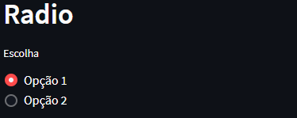
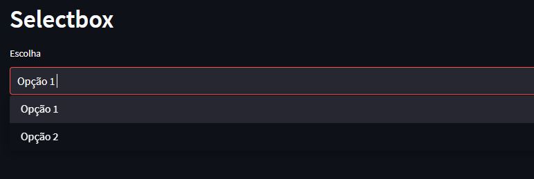
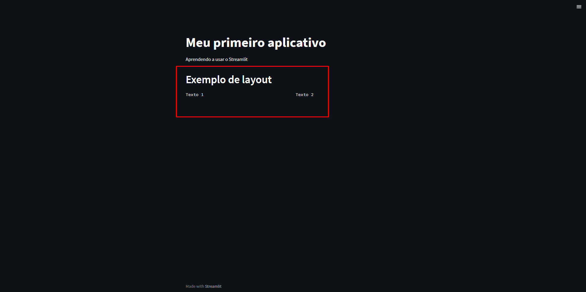

# Streamlit

## Introdução
Streamlit é uma ferramenta que permite criar aplicativos web de forma simples e rápida. A ideia é que o desenvolvedor possa focar na lógica do aplicativo e não em como criar uma interface gráfica para ele.

Para começa a usar o Streamlit, basta instalar o pacote com o comando abaixo:

```bash
pip install streamlit
```
A partir daí, você já pode começar a criar seus aplicativos. Para isso, basta criar um arquivo .py e importar o pacote streamlit. Para executar o aplicativo, basta executar o comando abaixo:

```bash
streamlit run nome_do_arquivo.py
```

## Criando um aplicativo
Para criar um aplicativo, basta importar o pacote streamlit e começar a escrever o código. O código abaixo cria um aplicativo que mostra o título e um texto.

```python
import streamlit as st

st.title('Meu primeiro aplicativo')
st.write('Aprendendo a usar o Streamlit')
```

## Widgets
Os widgets são os elementos que compõem a interface gráfica do aplicativo. O Streamlit possui vários widgets que podem ser usados para criar um aplicativo. Abaixo, temos alguns exemplos de widgets.

### Texto
O widget de texto é usado para exibir textos na tela. O código abaixo cria um widget de texto.

```python
import streamlit as st

st.title('Meu primeiro aplicativo')
st.write('Aprendendo a usar o Streamlit')

st.header('Exemplo de texto')
st.text('Texto simples')
st.markdown('Texto em markdown')

st.subheader('Exemplo de texto')
st.success('Texto de sucesso')
st.warning('Texto de aviso')
st.error('Texto de erro')
st.exception('Texto de exceção')

```

### Imagem
O widget de imagem é usado para exibir imagens na tela. O código abaixo cria um widget de imagem.

```python
st.image('images/teste.jpg')
```

Resultado:


### Botão
O widget de botão é usado para criar botões na tela. O código abaixo cria um widget de botão.

```python
st.button('Botão')
```

Resultado:


### Checkbox
O widget de checkbox é usado para criar checkbox na tela. O código abaixo cria um widget de checkbox.

```python
st.checkbox('Checkbox')
```

Resultado:


### Radio
O widget de radio é usado para criar radio na tela. O código abaixo cria um widget de radio.

```python
st.radio('Radio', ('Opção 1', 'Opção 2'))
```

Resultado:



### Selectbox
O widget de selectbox é usado para criar selectbox na tela. O código abaixo cria um widget de selectbox.


```python
st.selectbox('Selectbox', ('Opção 1', 'Opção 2'))
```

Resultado:




Existem outros widgets que podem ser usados para criar um aplicativo. Para saber mais sobre os widgets, acesse a [documentação](https://docs.streamlit.io/en/stable/api.html).

## Layout
O Streamlit permite criar um layout para o aplicativo. O código abaixo cria um layout para o aplicativo.

```python

st.title('Meu primeiro aplicativo')
st.write('Aprendendo a usar o Streamlit')

st.header('Exemplo de layout')
st.text('Texto 1')

col1, col2 = st.columns(2)

with col1:
    st.text('Texto 2')

with col2:
    st.text('Texto 3')

```

Resultado:




